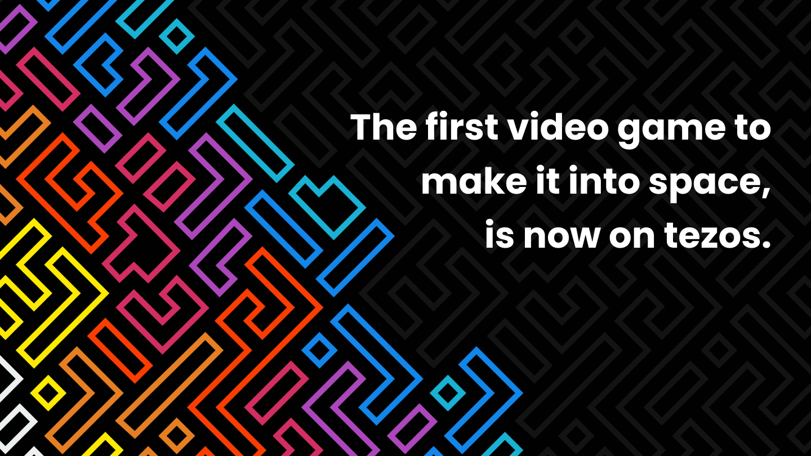

# TezTile
The first video game to make it into space, is now on Tezos.



## Live At : https://www.teztile.xyz/

Application is in Ghostnet right now ! To get the Ctez and USDT.e that we use drop us an email at ```contact@teztile.xyz``` or create an issue.


## Demo : https://youtu.be/QKdMILSf3mo


## Deployed Contracts V1

TezTile Game : KT1KY1nnwawbqyXz2g2b9tS7qCaiEidnkZWb

TezTile NFTs : KT1UHy8rtoz6puuxPbbwafVxkBAhhNb1yw9M

## Deployed Contracts V2

TezTile Game : KT1FjNorFCBAxvWFK4k15nyiFiGBb4T12Gpx

TezTile NFTs : KT1TVGLKpsT8i7tBQJXQTx7oBnuD9tUXrvjf

## Deployed Contracts Mainnet

Teztile Game : KT1TkkM9g5TB2sZ86aomf1tF2kEVC5Yec6jU

Teztile NFTs : KT1Vz5Epeh12sh3oXZRXCqYe2tTV5phA82AH


## Wallets

admin : tz1NhKzAZkzB1SExnt1ECtfvuGE6n5VSLctL
SOS : tz1NaGu7EisUCyfJpB16ktNxgSqpuMo8aSEk
Treasury : tz1WwdxyWajE28JnN5FWn2XRR4XcXiBEAC1J


## To Run in your local machine 

1. Clone The Repo
2. Go Into build folder
 ``` cd build ```
3. Install required packages
  ``` yarn install```
4. Build the FE
 ``` yarn dev ```
